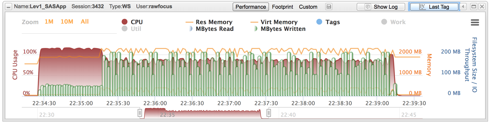

# Bizarro Ball 

## TLDR;

To get the Bizarro Ball data, simply run the following:

```
filename bizarro url 
  "https://raw.githubusercontent.com/allanbowe/BizarroBall/master/bizarroball.sas";
%inc bizarro;
```
Note - this can take 4-5 minutes to run, as there is a lot of data!  It will be saved in your SASUSER library/folder, change this location manually if desired.



After the data is loaded you can remap the libraries in future sessions as follows:

```
filename bizarro url
  "https://raw.githubusercontent.com/allanbowe/BizarroBall/master/autoexec.sas";
%inc bizarro;
```

## Wait - What Is This?

This repository contains the sample data used in the seminal book [Data Management Solutions Using SAS Hash Table Operations: A Business Intelligence Case Study](https://www.amazon.com/Management-Solutions-Using-Table-Operations/dp/1629601438) by [Paul Dorfman](https://www.linkedin.com/in/pauldorfman/) and [Don Henderson](https://www.linkedin.com/in/donaldjhenderson/).  More information on the incredible power of hashing can be found in their SGF2017 paper [Beyond Table Lookup: The Versatile SAS® Hash Object ](https://support.sas.com/resources/papers/proceedings17/0821-2017.pdf).

The code itself is documented [here](https://allanbowe.github.io/bizarro.github.io/) and was originally sourced from [here](https://support.sas.com/downloads/package.htm?pid=2247#) and [here](http://www.sascommunity.org/wiki/Beyond_Table_Look-up:_The_Versatile_SAS_Hash_Object).

An article on this data is also available on [communities](https://communities.sas.com/t5/SAS-Communities-Library/Bizarro-Ball-Make-a-Hash-of-it/ta-p/524757).

## Who Is It For?
Primarily this data is useful (and was prepared specifically) for readers of the aforementioned [book](https://www.amazon.com/Management-Solutions-Using-Table-Operations/dp/1629601438), however the authors have given permission for the data to be used for other purposes as well - such as testing, education, development, and demos.

Unlike the sample data in SASHELP, the Bizarro data can _modified_.  It also contains some interesting properties (such as md5 hashed indexes / surrogate keys).

## How Do I Use It?

For ease of extraction, the files are built into a single [bizarroball.sas](bizarroball.sas) file that can be easily copy pasted into a SAS session.

Simply modify the `root` variable (to a permanent path, if desired), and hit RUN.

This produces the following data:
* 32 teams (2 leagues, each with 16 teams)
* 1,600 Players (2 leagues * 16 teams * 50 players)
* 992 games over 31 days ( 16 morning games and 16 afternoon games for each of 31 days)
* 27,776 batter x game combinations (each team has 14 batters in each of the 62 games)
* 17,856 pitcher x game combinations (each team has 9 pitchers, who each pitch one inning, in each of the 62 games)
* 98,769 plate appearances across all the teams/games. This number can be varied based on the random number seeds used to determine the results of each pitch. Note that this data includes details on what bases a given runner occupies at the completion of each plate appearance.
* 301,506 pitches for those 98,769 plate appeances.
* 23,901 runs scored

## This Is Great!  How Do I Show My Appreciation?

After you have bought the [book](https://www.amazon.com/Management-Solutions-Using-Table-Operations/dp/1629601438), feel free to hit the STAR button at the top of this [repo](https://github.com/allanbowe/BizarroBall) so others can learn about (and benefit from) this contribution


